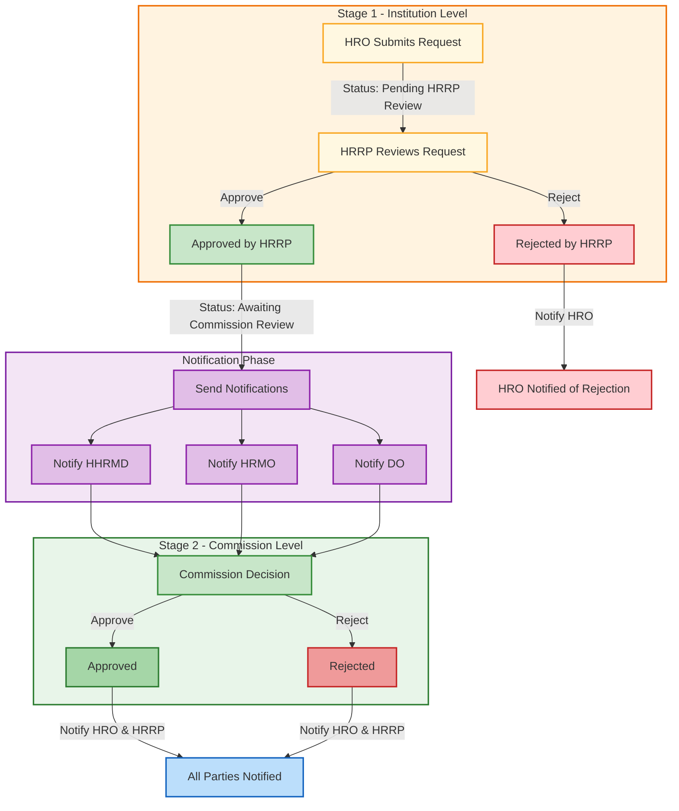
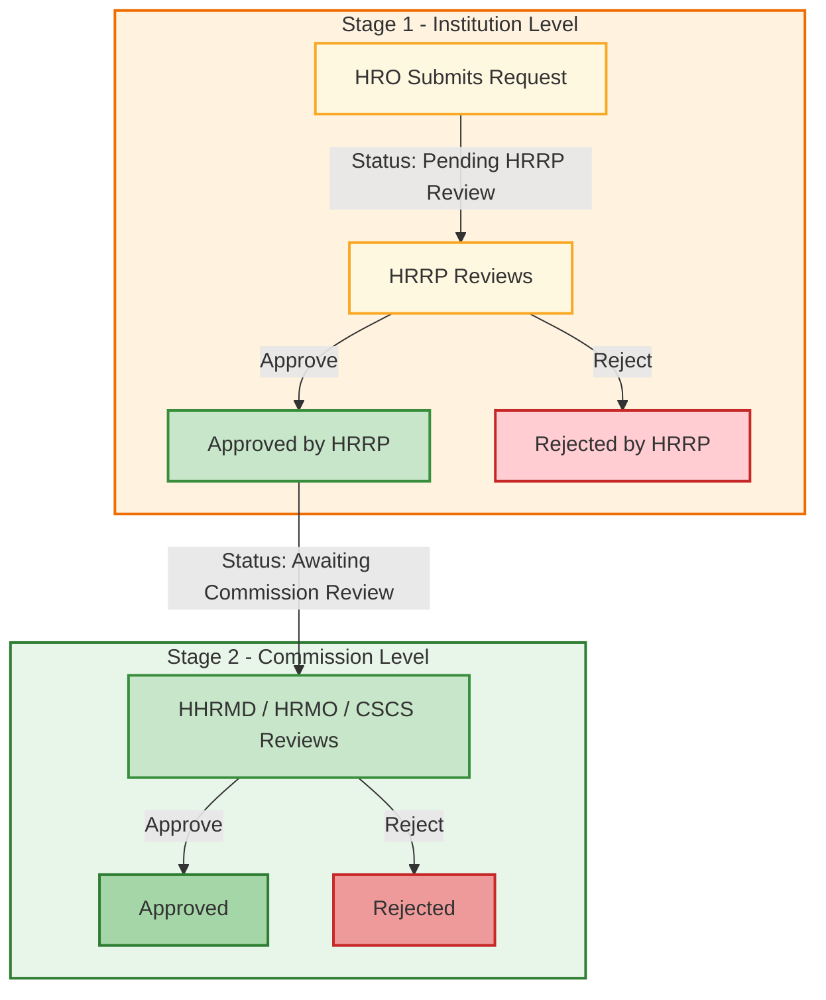
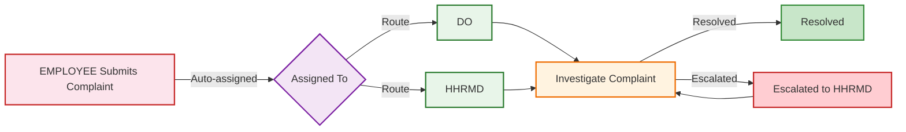

# CSMS User Roles and Functions

This document describes all user roles in the Civil Service Management System (CSMS) and their respective functions, permissions, and data access scope.

---

## Role Overview

| Role | Full Name | Data Scope | Level |
|------|-----------|------------|-------|
| HRO | Human Resource Officer | Own institution | Institution |
| HRRP | Human Resource Responsible Personnel | Own institution | Institution |
| HRMO | Human Resource Management Officer | All institutions | Commission |
| HHRMD | Head of Human Resource Management Department | All institutions | Commission |
| DO | Disciplinary Officer | All institutions | Commission |
| CSCS | Civil Service Commission Secretary | All institutions | Commission |
| PO | Planning Officer | All institutions | Commission |
| EMPLOYEE | Employee (Self-Service) | Own data only | Individual |
| Admin | System Administrator | System-wide | System |

---

## 1. HRO (Human Resource Officer)

**Scope:** Institution-based role assigned to a specific ministry or institution.

### Functions

- **Employee Management**
  - Search employees within own institution
  - View employee profiles
  - Add employees manually (if institution has `manualEntryEnabled`)

- **HR Request Submission**
  - Submit confirmation requests
  - Submit LWOP (Leave Without Pay) requests
  - Submit promotion requests
  - Submit cadre change requests
  - Submit retirement requests
  - Submit resignation requests
  - Submit service extension requests
  - Submit termination requests

- **Monitoring**
  - View employees needing urgent attention (probation overdue, nearing retirement)
  - Track status of submitted requests
  - View recent activities overview

- **Reports**
  - Generate reports (excluding complaints reports)

### Restrictions

- Cannot create or manage system users
- Cannot approve requests (submission only)
- Cannot view data from other institutions
- Cannot handle complaints
- Cannot perform bulk employee uploads without Admin role

---

## 2. HRRP (Human Resource Responsible Personnel)

**Scope:** Institution-based role assigned to a specific ministry or institution. Acts as the first-level approver in the workflow chain.

### Functions

- **HR Request Approval (First Level)**
  - Review requests submitted by HRO at the same institution
  - Approve and forward requests to Commission (HHRMD/HRMO)
  - Reject requests with reasons

- **Direct Submission**
  - Submit HR requests directly (bypasses initial HRO submission step)

- **Monitoring**
  - View employees needing urgent attention
  - View employee profiles within own institution
  - Track status of requests
  - View recent activities overview

- **Reports**
  - Generate reports (excluding complaints reports)

### Workflow Position

### Restrictions

- Cannot create or manage system users
- Cannot view data from other institutions
- Cannot handle complaints
- Cannot make final decisions on HR requests

---

## 3. HHRMD (Head of Human Resource Management Department)

**Scope:** Commission role with access to all institutions data.

### Functions

- **HR Request Review and Approval (Final)**
  - Review and approve/reject confirmation requests
  - Review and approve/reject LWOP requests
  - Review and approve/reject promotion requests
  - Review and approve/reject cadre change requests
  - Review and approve/reject retirement requests
  - Review and approve/reject resignation requests
  - Review and approve/reject service extension requests
  - Review and approve/reject termination requests

- **Disciplinary Actions**
  - Handle dismissal requests
  - Review complaints

- **Institution Management**
  - View all institutions and their employees
  - View employee profiles across all institutions

- **Monitoring**
  - Track all requests across the system
  - View recent activities overview

- **Reports**
  - Generate all report types including complaints

- **User Management**
  - View system user list

---

## 4. HRMO (Human Resource Management Officer)

**Scope:** Commission role with access to all institutions data.

### Functions

- **HR Request Review and Approval**
  - Review and approve/reject confirmation requests
  - Review and approve/reject LWOP requests
  - Review and approve/reject promotion requests
  - Review and approve/reject cadre change requests
  - Review and approve/reject retirement requests
  - Review and approve/reject resignation requests
  - Review and approve/reject service extension requests

- **Institution Management**
  - View all institutions and their employees
  - View employee profiles across all institutions

- **Monitoring**
  - Track all requests across the system
  - View recent activities overview

- **Reports**
  - Generate all report types

### Key Distinction from HHRMD

- Cannot handle dismissal or termination requests
- Cannot handle complaints

---

## 5. DO (Disciplinary Officer)

**Scope:** Commission role with access to all institutions data. Primary handler for complaints and disciplinary actions.

### Functions

- **Disciplinary Actions**
  - Handle termination requests
  - Handle dismissal requests
  - Review and resolve complaints submitted by employees

- **Institution Management**
  - View all institutions and their employees
  - View employee profiles across all institutions

- **Monitoring**
  - Track requests across the system
  - View recent activities overview

- **Reports**
  - Generate all report types

### Key Distinction

- Primary recipient of complaint notifications
- Focused on disciplinary and complaint resolution workflows

---

## 6. CSCS (Civil Service Commission Secretary)

**Scope:** Commission role with access to all institutions data. Highest operational role in the system.

### Functions

- **Full HR Request Access**
  - Review and approve/reject all request types:
    - Confirmations
    - LWOP
    - Promotions
    - Cadre changes
    - Retirements
    - Resignations
    - Service extensions
    - Terminations

- **Complaints Management**
  - Handle and resolve complaints

- **Institution Management**
  - View all institutions and their employees
  - View employee profiles across all institutions

- **Monitoring**
  - Track all requests across the system
  - View recent activities overview

- **Reports**
  - Generate all report types

---

## 7. PO (Planning Officer)

**Scope:** Commission role with access to all institutions data. Read-only access focused on analytics.

### Functions

- **Reports and Analytics**
  - View reports across all institutions
  - Generate reports (excluding complaints)

### Restrictions

- Cannot submit, review, or approve HR requests
- Cannot handle complaints
- Cannot manage employees or institutions
- No access to urgent actions or admin pages
- Redirected to profile page on login

---

## 8. EMPLOYEE (Self-Service)

**Scope:** Individual role linked to a specific employee record.

### Functions

- **Profile Management**
  - View own employee profile

- **Complaints**
  - Submit new complaints

- **Tracking**
  - Track own submitted requests

### Restrictions

- Cannot access dashboard overview (redirected to profile page)
- Cannot submit HR requests
- Cannot view other employees' data
- Cannot access admin pages
- Cannot access reports, recent activities, or urgent actions
- Cannot manage institutions

---

## 9. Admin (System Administrator)

**Scope:** System-wide role for technical administration. Not a Commission role.

### Functions

- **User Management**
  - Create new system users
  - View all system users
  - Lock/unlock user accounts
  - Reset user passwords

- **Institution Management**
  - Create and manage institutions

- **HRIMS Integration**
  - Fetch employee data from HRIMS
  - Fetch employee photos and documents
  - Configure HRIMS settings
  - Test HRIMS connectivity

- **Security and Audit**
  - Monitor security events
  - View unauthorized access attempts
  - View and cleanup expired user sessions

### Restrictions

- Cannot lock another Admin account
- Cannot view all employee data by default (not a CSC role)
- Recent Activities section hidden on dashboard
- Cannot approve or reject HR requests
- Cannot handle complaints

---

## Data Access Summary

### Commission Roles (CSC_ROLES)

HHRMD, HRMO, DO, CSCS, and PO are Commission roles that can see data across all institutions. These roles are defined in `src/lib/role-utils.ts`.

### Institution Roles

HRO and HRRP can only see data within their assigned institution. Data is automatically filtered based on the user's institution assignment.

### Admin Role

Admin is explicitly excluded from CSC_ROLES. The Admin role is limited to system administration and does not grant access to employee data by default.

---

## Request Workflow

Most HR requests follow a two-stage approval process:

### Complaints Workflow

---

## Related Files

| File | Purpose |
|------|---------|
| `src/lib/types.ts` | Role type definitions |
| `src/lib/constants.ts` | ROLES constant mapping |
| `src/lib/role-utils.ts` | CSC role identification and institution filtering |
| `src/lib/route-permissions.ts` | Route-level permission matrix |
| `src/lib/navigation.ts` | Sidebar navigation per role |
| `src/lib/api-auth.ts` | API authentication and role enforcement |
