# CSMS User Roles and Functions - Workflow Diagrams

Visual representation of all workflows in the Civil Service Management System.

---

## 1. Role Hierarchy and Relationships

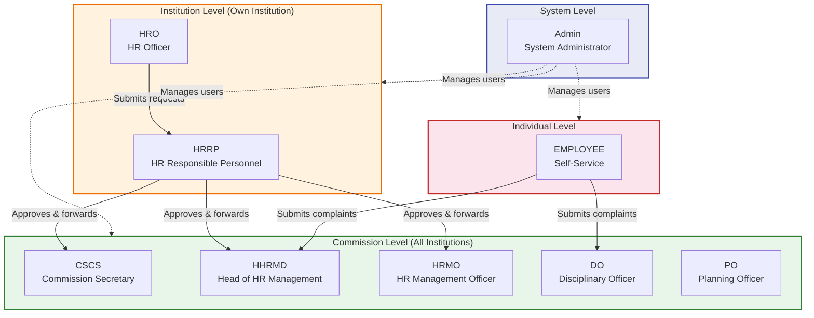

---

## 2. HR Request Approval Workflow

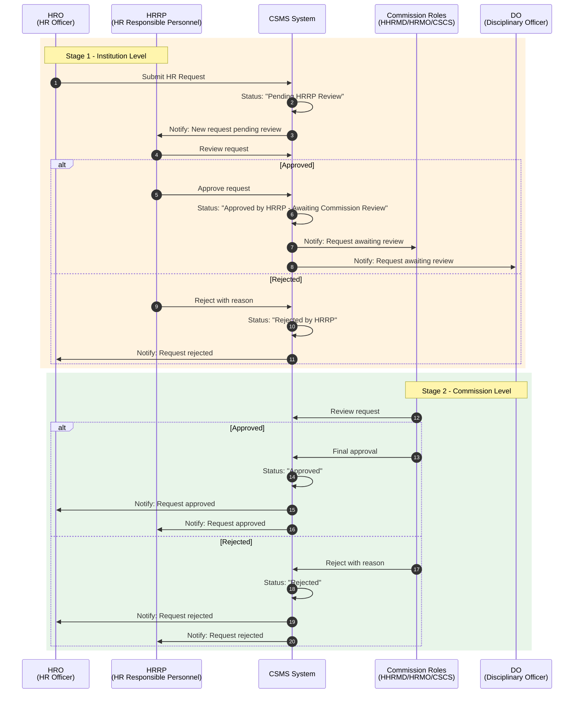

---

## 3. Complaints Workflow

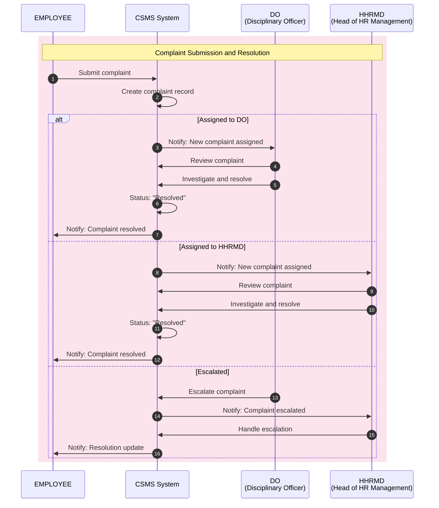

---

## 4. HRO (Human Resource Officer) Functions

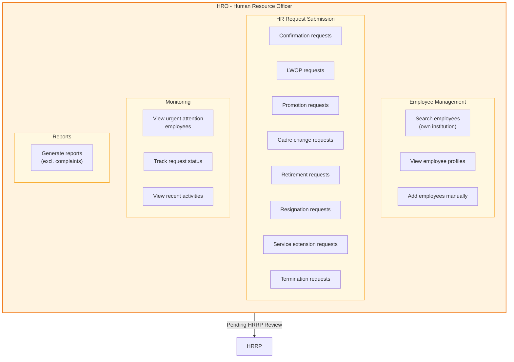

---

## 5. HRRP (Human Resource Responsible Personnel) Functions

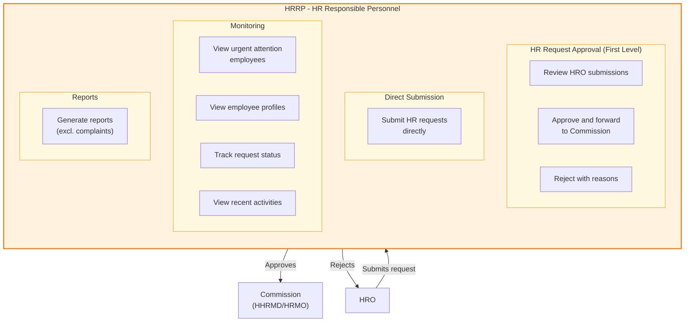

---

## 6. HHRMD (Head of HR Management Department) Functions

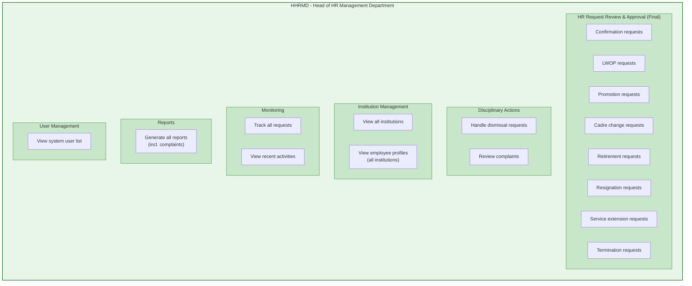

---

## 7. HRMO (Human Resource Management Officer) Functions

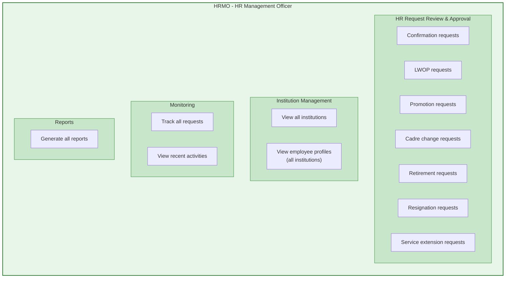

---

## 8. DO (Disciplinary Officer) Functions

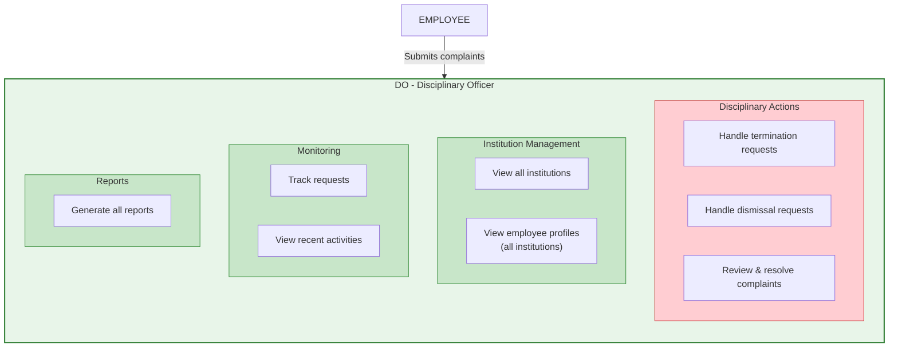

---

## 9. CSCS (Civil Service Commission Secretary) Functions

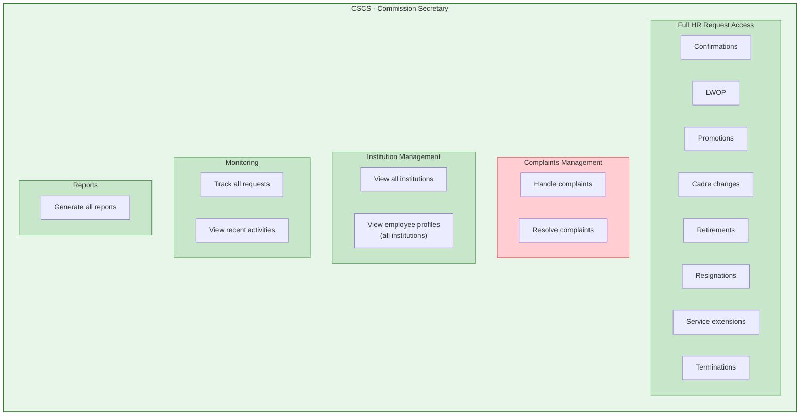

---

## 10. PO (Planning Officer) Functions

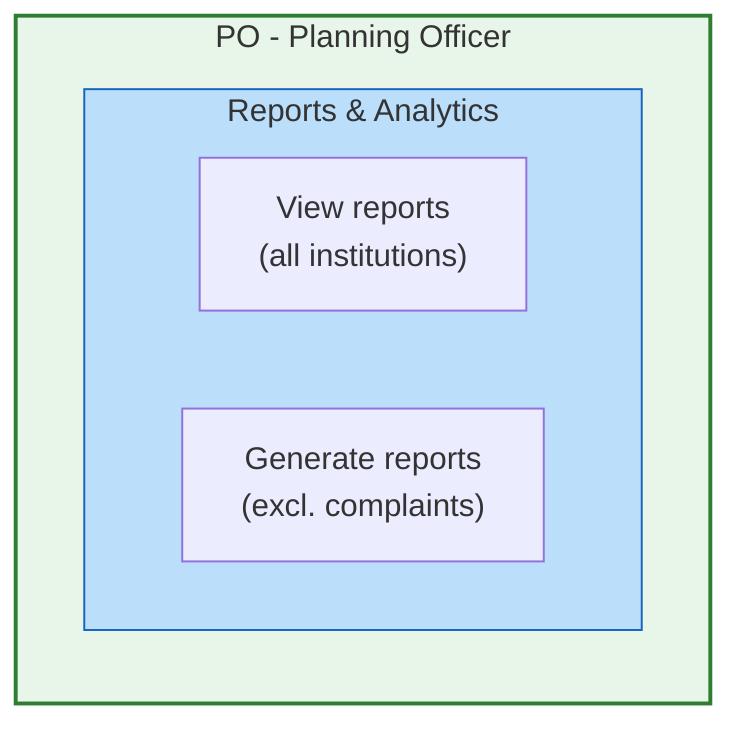

---

## 11. EMPLOYEE (Self-Service) Functions

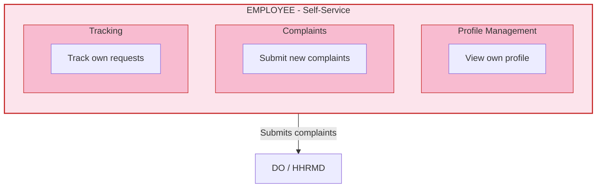

---

## 12. Admin (System Administrator) Functions

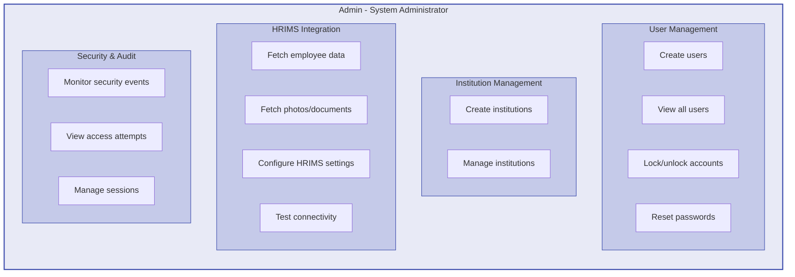

---

## 13. Data Access Scope

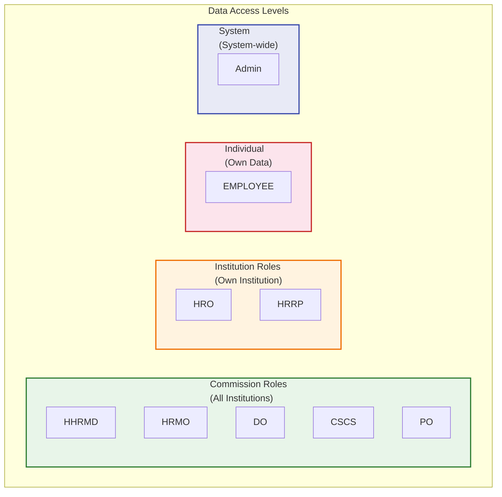

---

## 14. Request Status State Diagram

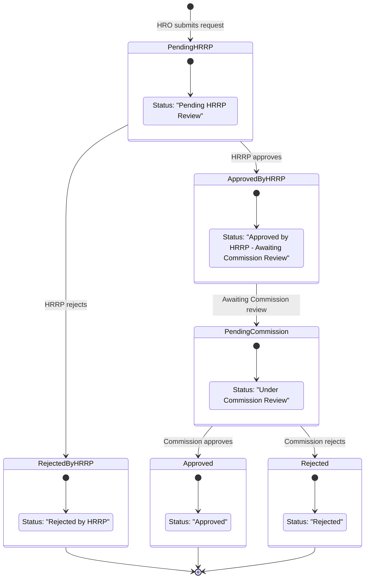

---

## 15. Complaint Status State Diagram

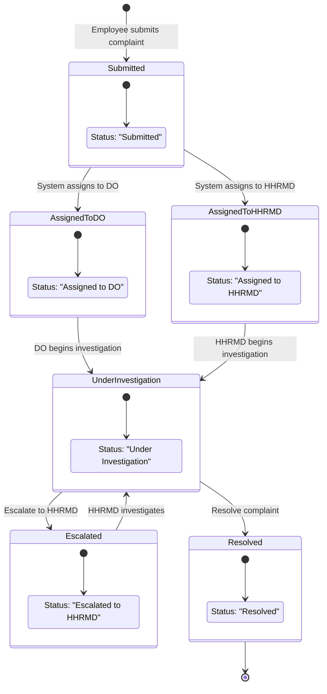

---

## Legend

| Color | Meaning |
|-------|---------|
| Orange | Institution-level roles (HRO, HRRP) |
| Green | Commission-level roles (HHRMD, HRMO, DO, CSCS, PO) |
| Red | Individual role (EMPLOYEE) |
| Blue | System role (Admin) |
| Pink | Disciplinary/Complaint functions |
| Light Blue | Read-only/Analytics functions |

---

*Generated from CSMS User Roles and Functions documentation.*
