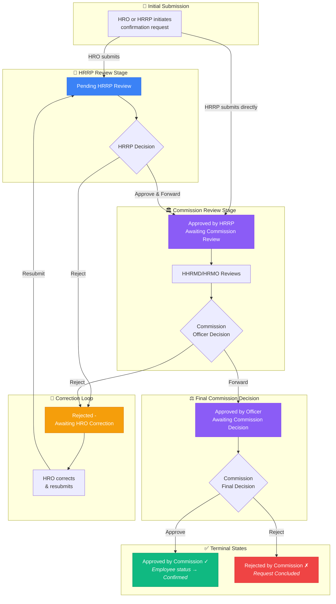
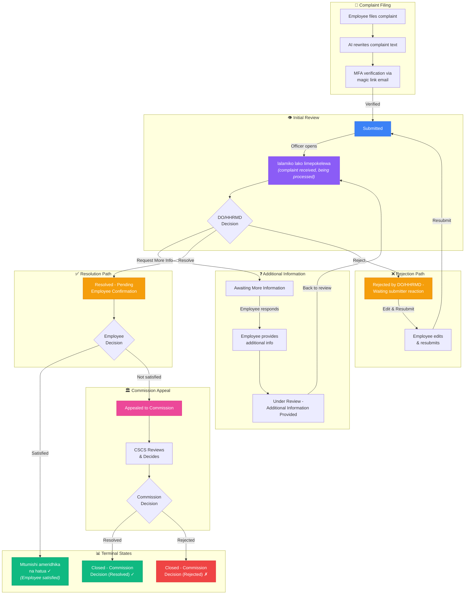

# CSMS Workflow Diagrams

## Table of Contents

1. [Confirmation Module Workflow](#1-confirmation-module-workflow)
2. [Complaints Module Workflow](#2-complaints-module-workflow)

---

## 1. Confirmation Module Workflow

The Confirmation module handles the process of confirming civil service employees after their probation period.

### Roles Involved

| Role | Full Name | Responsibilities |
|------|-----------|------------------|
| **HRO** | Human Resource Officer | Initiates requests, corrects rejected requests |
| **HRRP** | Human Resource Responsible Personnel | First reviewer, forwards to commission or rejects |
| **HHRMD** | Head of HR Management Division | Commission-level reviewer, final decision |
| **HRMO** | HR Management Officer | Commission-level reviewer, final decision |
| **CSCS** | Civil Service Commission Secretary | Read-only visibility |

### Workflow Diagram

### Status Transitions Table

| From Status | Trigger | To Status | Review Stage |
|-------------|---------|-----------|--------------|
| *(new)* | HRO submits | Pending HRRP Review | initial |
| *(new)* | HRRP submits directly | Approved by HRRP - Awaiting Commission Review | hrrp_review |
| Pending HRRP Review | HRRP approves | Approved by HRRP - Awaiting Commission Review | hrrp_review |
| Pending HRRP Review | HRRP rejects | Rejected by HRRP - Awaiting HRO Correction | initial |
| Approved by HRRP... | HHRMD/HRMO forwards | Approved by {role} - Awaiting Commission Decision | commission_review |
| Approved by HRRP... | HHRMD/HRMO rejects | Rejected by {role} - Awaiting HRO Correction | initial |
| Approved by {role}... | Commission approves | **Approved by Commission** | completed |
| Approved by {role}... | Commission rejects | **Rejected by Commission - Request Concluded** | completed |
| Rejected... Awaiting HRO | HRO resubmits | Pending HRRP Review | initial |

### Required Documents

- Evaluation Form (PDF)
- Letter of Request (PDF)
- IPA Certificate (PDF) - required if employee hired after May 1, 2014

### Validation Rules

- **Blocked** for employees with status: On LWOP, Retired, Resigned, Terminated, Dismissed
- **Allowed** for employees with status: On Probation (normal case)
- Duplicate pending requests for the same employee are blocked

### Key API Endpoints

| Endpoint | Method | Purpose |
|----------|--------|---------|
| `/api/confirmations` | GET | List requests (paginated, filtered by role/institution) |
| `/api/confirmations` | POST | Create new confirmation request |
| `/api/confirmations` | PATCH | Approve, reject, or resubmit |

---

## 2. Complaints Module Workflow

The Complaints module allows civil service employees to file complaints and track their resolution through a multi-stage review process.

### Roles Involved

| Role | Full Name | Responsibilities |
|------|-----------|------------------|
| **EMPLOYEE** | Employee/Complainant | Files complaints, provides additional info, confirms resolution |
| **DO** | Disciplinary Officer | Reviews and resolves complaints |
| **HHRMD** | Head of HR Management Department | Reviews and resolves complaints |
| **CSCS** | Civil Service Commission Secretary | Handles appeals, makes commission decisions |

### Workflow Diagram

### Status Transitions Table

| From Status | Trigger | To Status | Review Stage |
|-------------|---------|-----------|--------------|
| *(new)* | MFA verified, complaint created | Submitted | initial |
| Submitted | Officer opens details | lalamiko lako limepokelewa, linafanyiwa kazi | initial |
| lalamiko lako... | Officer resolves | Resolved - Pending Employee Confirmation | completed |
| lalamiko lako... | Officer requests info | Awaiting More Information | completed |
| lalamiko lako... | Officer rejects | Rejected by DO/HHRMD - Waiting submitter reaction | initial |
| Awaiting More Information | Employee provides info | Under Review - Additional Information Provided | initial |
| Resolved - Pending... | Employee satisfied | **Mtumishi ameridhika na hatua** | completed |
| Resolved - Pending... | Employee appeals | Appealed to Commission | final_decision |
| Rejected by DO/HHRMD... | Employee resubmits | Submitted | initial |
| Appealed to Commission | Commission resolves | **Closed - Commission Decision (Resolved)** | final_decision |
| Appealed to Commission | Commission rejects | **Closed - Commission Decision (Rejected)** | final_decision |

### Complaint Filing Requirements

- Government email domain required (`.go.tz` or `.ac.tz`)
- AI text rewriting is mandatory before submission
- MFA verification via magic link is required
- Optional PDF attachments

### Key API Endpoints

| Endpoint | Method | Purpose |
|----------|--------|---------|
| `/api/complaints` | GET | List complaints (role-based filtering, pagination) |
| `/api/complaints` | POST | Create complaint (direct, non-MFA path) |
| `/api/complaints/[id]` | PUT | Update complaint status, comments, attachments |
| `/api/complaints/mfa-initiate` | POST | Send magic link email for MFA |
| `/api/complaints/magic-link-verify` | POST | Verify magic link and create complaint |

### Filtering Status Groups

| Group | Included Statuses |
|-------|-------------------|
| **Closed** | Closed - Satisfied, Mtumishi ameridhika na hatua, Closed - Commission Decision (Resolved), Closed - Commission Decision (Rejected) |
| **Resolved** | Closed - Satisfied, Mtumishi ameridhika na hatua, Closed - Commission Decision (Resolved) |
| **Rejected** | Closed - Commission Decision (Rejected) |

---

*Document generated: 2026-05-29*
